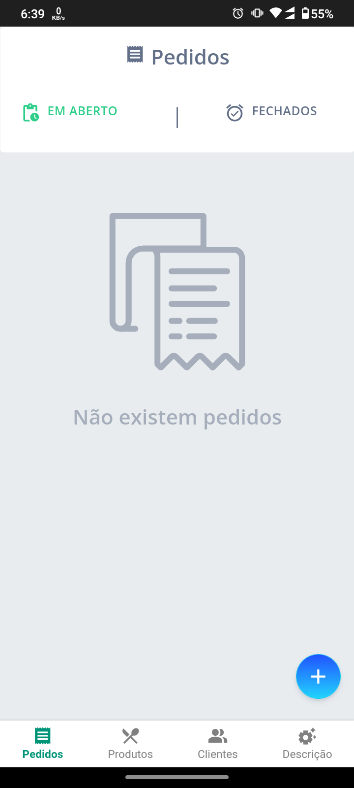
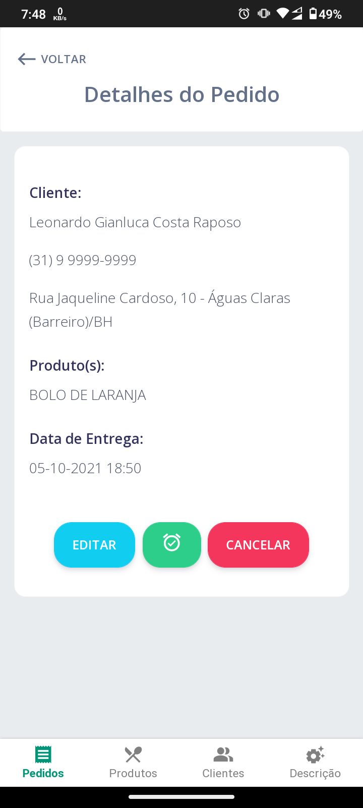
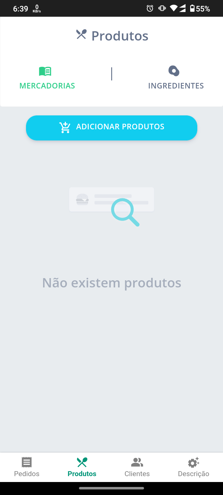
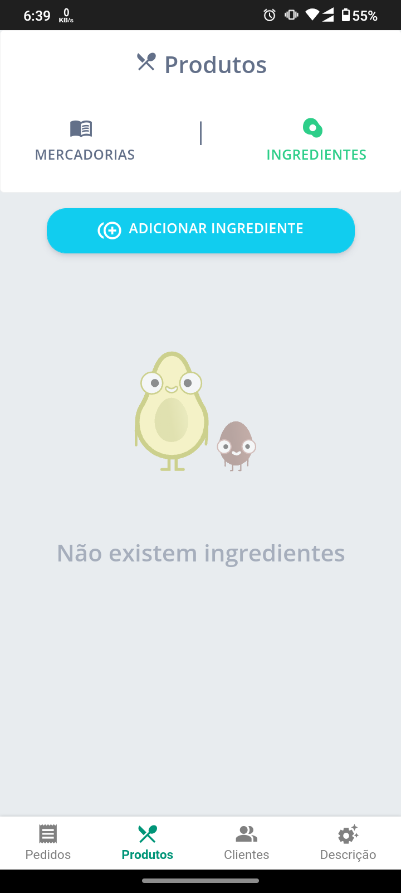
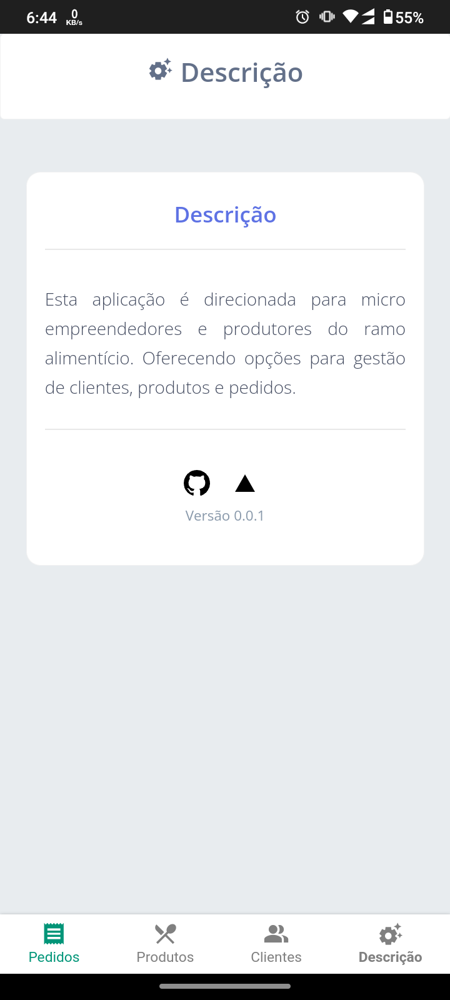

<h1 align="center">
  
</h1>

  
  
  
  
  

&nbsp;

## 💻 GG - Gestão Gastrô
&nbsp;

**Leonardo Gianluca Costa Raposo**

O objetivo desta aplicação é otimizar o processo dos micro empreendedores e produtores do ramo alimentício oferecendo:

- Controle da cartela de clientes;
- Gestão de pedidos em andamento e concluídos;
- Registro de produtos e receitas (ingredientes);
- Processo de orçamentos;

&nbsp;
## 1. Interfaces

### Tela principal - Pedidos

Nesta tela, por padrão o usuário poderá visualizar seus pedidos ***"Em Andamento"***. Se não existirem registros será apresentado um gif e um texto identificando que não existem registros.
Como apresentado abaixo:

Clicando no botão com o simbolo '+' é possível realizar a inserção de um novo pedido que será mostado mais adiante.

Caso o usuário clique em ***"Fechados"*** irá visualizar seus pedidos concluídos se existirem. Conforme apresentado abaixo:

### Cadastro de Pedido

Nesta tela o usuário poderá selecionar um cliente, quantos produtos estiverem disponíveis e a Data/Hora de entrega para o pedido.

## GIF

### Detalhes de Pedido

Ao clicar no icone de interrogação na tela de pedidos *"Em Aberto"* ou *"Concluídos"* o usuário será levado a tela onde serão apresentados os detalhes do pedido.
Informações sobre o cliente, produtos relacionados e a data de entrega.

Essa tela também apresenta ao usuario as opções de:

- Finalizar o pedido;
- Editar o pedido;
- Excluir o pedido.

Com a opção de edição o usuário será enviado para o formulario podendo atualizar os produtos selecionados e a data de entrega.

### Tela de produtos

Como nas outras telas de listagem, caso não existam registros será apresentado um gif e texto explicativo.

Nessa tela será possível ***adicionar***, ***remover*** e ***editar*** os registros.

Clicando no botão de ***adição*** o usuario irá preencher o nome do produto e quantos ingredientes são necessarios para criação do item (como uma receita).

Clicando no ***lapis*** o usuario será levado para a tela de edição, onde poderá alterar o nome, adicionar ou remover ingredientes.

Clicando na ***lixeira*** o usuario removerá o registro.

### Tela de Ingredientes

Como nas outras telas de listagem, caso não existam registros será apresentado um gif e texto explicativo.

Nessa tela será possível ***adicionar***, ***remover*** e ***editar*** os registros.

Clicando no botão de ***adição*** o usuario irá preencher o nome do ingrediente.

Clicando no ***lapis*** o usuario será levado para a tela de edição, onde poderá alterar o nome do ingrediente.

Clicando na ***lixeira*** o usuario removerá o registro.

### Tela de Clientes

Como nas outras telas de listagem, caso não existam registros será apresentado um gif e texto explicativo.

Nessa tela ao clicar no botão de adição o usuario será levado ao formulario de cadastro.

Ao clicar na interrogação(?) o usuario será levado a tela de detalhes.

### Cadastro de Cliente

O usuario poderá cadastrar seus clientes com as seguinte informações:

- Nome;
- Telefone;
- Endereço (CEP, rua, número, bairro e cidade).

### Detalhes do Cliente

Nesta tela serão apresentados os dados do cliente e será possível remover ou editar os registros.

No momento da edição todos os dados estão disponíveis para alteração.

### Descrição

Nesta tela apenas é apresentado uma mini descrição sobre a aplicação e a referencia do respotorio no GitHub.

## 2. Dados do usuário

Nesta aplicação, os dados do usuário são armazenados por meio do LocalStorage e vinculados em outras telas, mantendo o seguinte fluxo.

- Cadastro e Edição de Ingredientes;
- Cadastro de Produtos que utilizam as informações do ingredientes;
- Castro, Visualização e Edição de Clientes;

Com todos estes passos conluídos é possível gerar um pedido vinculando o cliente e os produtos criados.

Durante a navegação das paginas os dados do usuario são passados como parametro através da url. Como uma forma de segurança os dados estão sendo encriptados para que não fiquem totalmente explicitos na url.

## 3. Checklist de implementação

- A aplicação é original e não uma cópia da aplicação de um colega ou de uma aplicação já existente? **Sim**
- A aplicação tem pelo menos duas interfaces (telas ou páginas) independentes? **Sim**
- A aplicação armazena e usa de forma relevante dados complexos do usuário? **Sim**
- A aplicação possui um manifesto para instalação no dispositivo do usuário? **Sim**
- A aplicação possui um _service worker_ que permite o funcionamento off-line? **Sim**
- O código da minha aplicação possui comentários explicando cada operação? **Sim**
- A aplicação está funcionando corretamente?
   
  **Não**. Existem falhas quanto a edição de **Produtos** e **Pedidos**, pois os dados não estão sendo retornados da forma que deveriam no componente de seleção. Impossibilitando o usuário de alterar os itens de produto e pedido.

- A aplicação está completa?
  **Sim**
