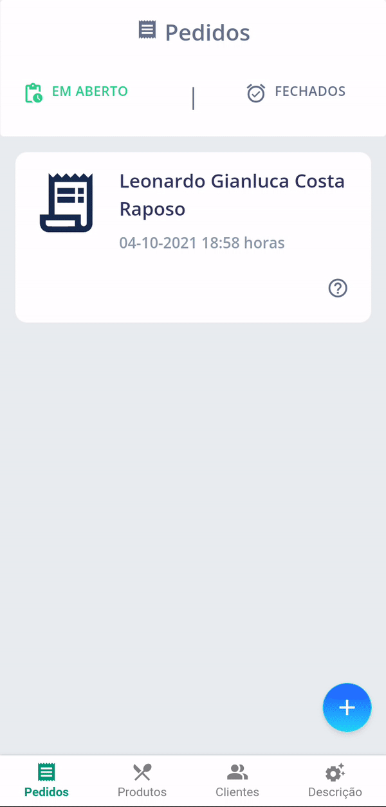
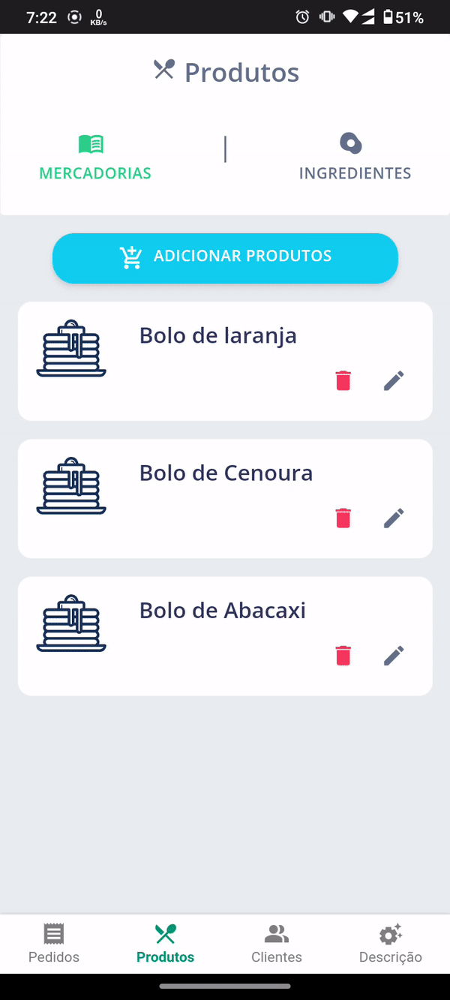
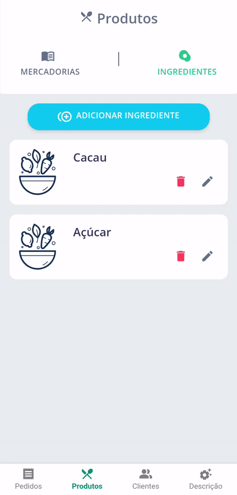

<h1 align="center">
 
</h1>
 

 
 
 
 
 

&nbsp;
 
## 💻 GG - Gestão Gastrô
&nbsp;
 
**Leonardo Gianluca Costa Raposo**
 
O objetivo desta aplicação é otimizar o processo dos micro empreendedores e produtores do ramo alimentício oferecendo:
 
- Controle da cartela de clientes;
- Gestão de pedidos em andamento e concluídos;
- Registro de produtos e receitas (ingredientes);
- Processo de orçamentos;
 
## 1. Interfaces
 
### Tela principal - Pedidos
 
Nesta tela, por padrão o usuário poderá visualizar seus pedidos ***"Em Andamento"***. Se não existirem registros será apresentado um gif e um texto identificando que não existem registros.
Como apresentado abaixo:
 

 
Clicando no botão com o símbolo '+' é possível realizar a inserção de um novo pedido que será mostrado mais adiante.
 
Caso o usuário clique em ***"Fechados"*** Irá visualizar seus pedidos concluídos se existirem. Conforme apresentado abaixo:
 

 
### Cadastro de Pedido
 
Nesta tela o usuário poderá selecionar um cliente, quantos produtos estiverem disponíveis e a Data/Hora de entrega para o pedido.
 
<<<<<<< HEAD

=======

>>>>>>> 39a2682af9c8e5ff420b073c30ac2bc8925c32b7
 
### Detalhes de Pedido
 
Ao clicar no ícone de interrogação na tela de pedidos *"Em Aberto"* ou *"Concluídos"* o usuário será levado a tela onde serão apresentados os detalhes do pedido.
Informações sobre o cliente, produtos relacionados e a data de entrega.
 
Essa tela também apresenta ao usuário as opções de:
 
- Finalizar o pedido;
- Editar o pedido;
- Excluir o pedido.
 

 
 
Com a opção de edição o usuário será enviado para o formulário podendo atualizar os produtos selecionados e a data de entrega.
 
### Tela de produtos
 
Como nas outras telas de listagem, caso não existam registros será apresentado um gif e texto explicativo.
 

 

 
 
Nessa tela será possível ***adicionar***, ***remover*** e ***editar*** os registros.
 
Clicando no botão de ***adição*** o usuário irá preencher o nome do produto e quantos ingredientes são necessários para criação do item (como uma receita).
 
Clicando no ***lapis*** O usuário será levado para a tela de edição, onde poderá alterar o nome, adicionar ou remover ingredientes.
 
Clicando na ***lixeira*** o usuário removerá o registro.
 
### Tela de Ingredientes
 
Como nas outras telas de listagem, caso não existam registros será apresentado um gif e texto explicativo.
 

 
Nessa tela será possível ***adicionar***, ***remover*** e ***editar*** os registros.
 
Clicando no botão de ***adição*** o usuário irá preencher o nome do ingrediente.
 
Clicando no ***lapis*** O usuário será levado para a tela de edição, onde poderá alterar o nome do ingrediente.
 
Clicando na ***lixeira*** o usuário removerá o registro.
 
### Tela de Clientes
 
Como nas outras telas de listagem, caso não existam registros será apresentado um gif e texto explicativo.
 

 
Nessa tela ao clicar no botão de adição o usuário será levado ao formulário de cadastro.
 
Ao clicar na interrogação(?) o usuário será levado a tela de detalhes.
 
### Cadastro de Cliente
 
O usuário poderá cadastrar seus clientes com as seguinte informações:
 
- Nome;
- Telefone;
- Endereço (CEP, rua, número, bairro e cidade).
 
### Detalhes do Cliente
 

 
Nesta tela serão apresentados os dados do cliente e será possível remover ou editar os registros.
 
No momento da edição todos os dados estão disponíveis para alteração.
 
### Descrição
 
Nesta tela apenas é apresentada uma mini descrição sobre a aplicação e a referência do repositório no GitHub.
 

 
## 2. Dados do usuário
 
Nesta aplicação, os dados do usuário são armazenados por meio do LocalStorage e vinculados em outras telas, mantendo o seguinte fluxo.
 
- Cadastro e Edição de Ingredientes;
- Cadastro de Produtos que utilizam as informações do ingredientes;
- Cadastro, Visualização e Edição de Clientes;
 
Com todos estes passos concluídos é possível gerar um pedido vinculando o cliente e os produtos criados.
 
Durante a navegação das páginas os dados do usuário são passados como parâmetro através da url. Como uma forma de segurança os dados estão sendo inscritos para que não fiquem totalmente explícitos na url.
 
## 3. Checklist de implementação
 
- A aplicação é original e não uma cópia da aplicação de um colega ou de uma aplicação já existente? **Sim**
- A aplicação tem pelo menos duas interfaces (telas ou páginas) independentes? **Sim**
- A aplicação armazena e usa de forma relevante dados complexos do usuário? **Sim**
- A aplicação possui um manifesto para instalação no dispositivo do usuário? **Sim**
- A aplicação possui um _service worker_ que permite o funcionamento off-line? **Sim**
- O código da minha aplicação possui comentários explicando cada operação? **Sim**
- A aplicação está funcionando corretamente?
 
 **Não**. Existem falhas quanto a edição de **Produtos** e **Pedidos**, pois os dados não estão sendo retornados da forma que deveriam no componente de seleção. Impossibilitando o usuário de alterar os itens de produto e pedido.
 
- A aplicação está completa?
 **Sim**
